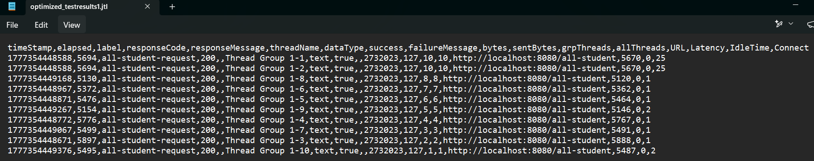
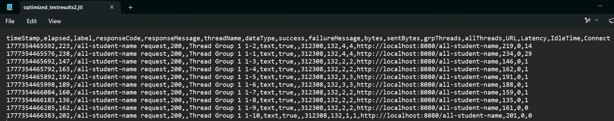
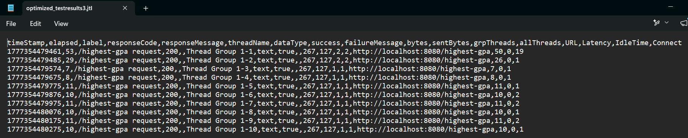

# Reflection for Module 7

### **1. What is the difference between the approach of performance testing with JMeter and profiling with IntelliJ Profiler in the context of optimizing application performance?** 
The difference is on IntelliJ Profiler I can really understand on depth about what function that takes so much time to execute and what are the bottlenecks that causing my application to be slow. On the other hand, performance testing with JMeter allows me to simulate the concurrency, reliability, and availability aspect of my applications. It can inform me if my app has 10 concurrent user hitting the same reqeust, what time is my application going to respond to them. So, with profiling approach I would optimize my application by refactoring the method that takes so much time to execute, and with JMeter I can analyze what time it actually took my apps to respond to concurrent users.

### **2. How does the profiling process help you in identifying and understanding the weak points in your application?**
The profiling process help me by showing me what methods that takes forever to load. For example on the highest-gpa task, IntelliJ Profiler show me that findStudentsWithHighestGPA() method is the method that causing the bottleneck. If I go to that method, the IntelliJ will show me -- on the left side of the line of code -- the time it takes to execute that method. For example on the findStudentWithHighestGpa() method, I see that the entire for loop only takes about 10-20 ms, but the query to fetch all students data (studentRepository.findAll) took 250 ms. From that information I can infer that I should focused on optimizing the query because that's the part that makes the method really slow.  

### **3. Do you think IntelliJ Profiler is effective in assisting you to analyze and identify bottlenecks in your application code?**
Yes, I do think it's very effective in assisting me to analyze and identify bottlenecks because it give me clear information about which method takes the most time, and IntelliJ also provide the timing information for each method on the left side when I open the code. But, There are view things that I'm not really familiar with, such as the profiling panel on the bottom that give me so many methods that are just the java system itself, which I don't understand and haven't really take usefull information about it. It's something like "java.Thread" and such. 

### **4. What are the main challenges you face when conducting performance testing and profiling, and how do you overcome these challenges?**
My first challenge is to get myself familiar with the IntelliJ Profiler bottom panel, because it have so much method from java system that I don't really know what is it for. Understanding the timeline graph was also hard for me because it doesn't really match with the example from the module tutorial. However, I try to search for method that I assumed have taken so much time on this particular request, I see it on the flame graph, I clicked on it and it opens the source code of that method and InttelliJ gives me information on the left-hand-side how much time it consumed for that particular method. For the method that was consuming the most time, IntelliJ give a red color for that method which makes me easily recognize that this method is the bottleneck. I also did a little bit of googling and asking to LLMs to confirm my findings.

### **5. What are the main benefits you gain from using IntelliJ Profiler for profiling your application code?**
The main benefits is I can infer which method that takes so much time and from that Information I can use that information to just focusing to optimize that part of the method. It provides me the information of what to optimize and what to not optimize. 

### **6. How do you handle situations where the results from profiling with IntelliJ Profiler are not entirely consistent with findings from performance testing using JMeter?**
At this exercise, I have never come to that situation. I try to optimize 3 methods, and each of them get a significantly better results both on the IntelliJ Profiler and JMeter performance testing. However, if I were to face that problem in the future, I would check wheter the method was still implementing single-thread or not. This is because single-threaded springboot apps can handle single request fast but not with 100 or more concurrent user. Profiler only record the performance for 1 request a time while JMeter approach can simulating the apps with a bunch of users that hit the app simultaneously. That's why on some cases -- particularly the single-threaded app cases -- profiler might generate great result but JMeter not.    

### **7. What strategies do you implement in optimizing application code after analyzing results from performance testing and profiling? How do you ensure the changes you make do not affect the application's functionality?**
For /all-student endpoint, I see the bottleneck is on the getAllStudentsWithCourses() method. After trying to understand the code, I just realized that I can fetch all studentCourse object using findAll(). All operation on the getAllStudentsWithCourses() method is just so much redundant. Hence, I delete all operations from that method to only studentCourseRepository.findAll(); Surprisingly, when I check the profiler again, the duration it takes for that method is very shortened (I forgot the number) and I try to test again using JMeter and the results go from 120 seconds (before optimization) to just 5 seconds!
For /all-student-name endpoint, I notice from the Profiler that the bottleneck of joinStudentNames() method is from the for loop that merge the String using += operations. I've heard later on the DSA class -- that I took last semester -- that using StringBuilder is so much faster when we want to merge Strings instead of using traditional String and += operations. So I try to use StringBuilder for this method and boom I got 50% improvement just from that changes! 
For /highest-gpa endpoint, I once again looked at my Profiler and see that the bottleneck on findStudentWithHighestGpa() method is on the studentRepository.findAll() query. Because this method only return 1 student with highest GPA, I try to make a JPA Method that can query a student with highest GPA in one single retrieval. I google and read the spring docs, and I found that findFirstByOrderByGpaDesc() would suited my needs. After I change it and test again, I got 60% performance improvement from that! I've got so much hype and learn so much just from this exercise. 

# Attachments

## Test Results for Test_Plan_1 (all-student-request)

  
Before Optimization [GUI]

  
Before Optimization [CLI]

  

  
After Optimization [CLI]

  

## Test Results for Test_Plan_2 (all-student-name-request)

  
Before Optimization [GUI]

  
Before Optimization [CLI]

  

  
After Optimization [CLI]

  

## Test Results for Test_Plan_3 (highest-gpa-request)

  
Before Optimization [GUI]

  
Before Optimization [CLI]

  

  
After Optimization [CLI]

  

